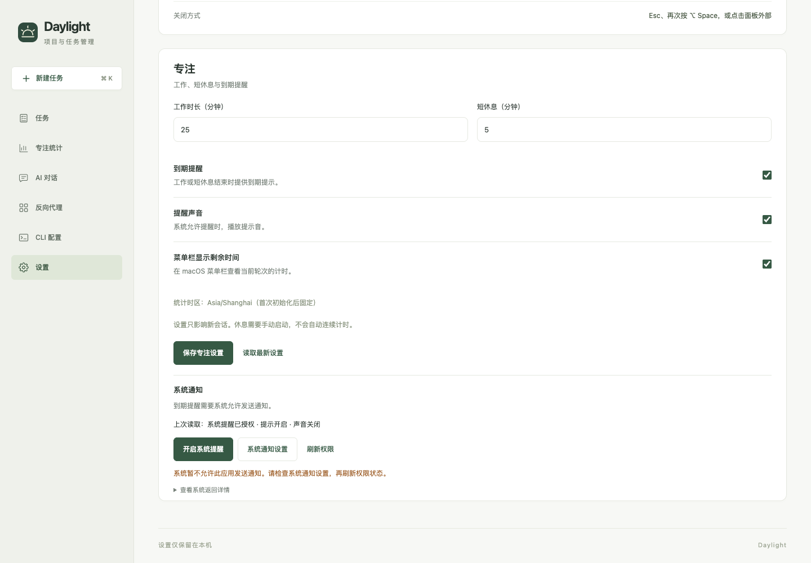
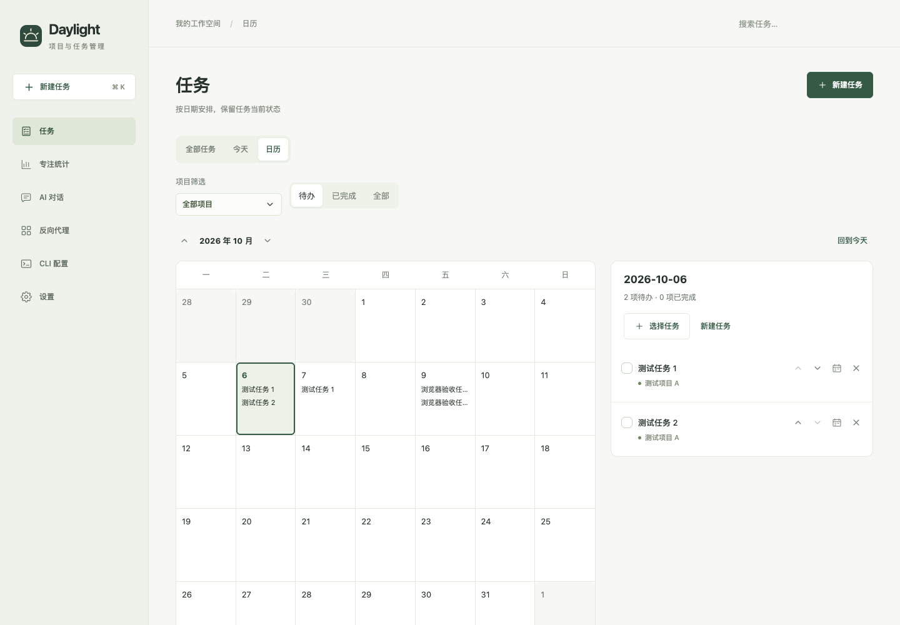
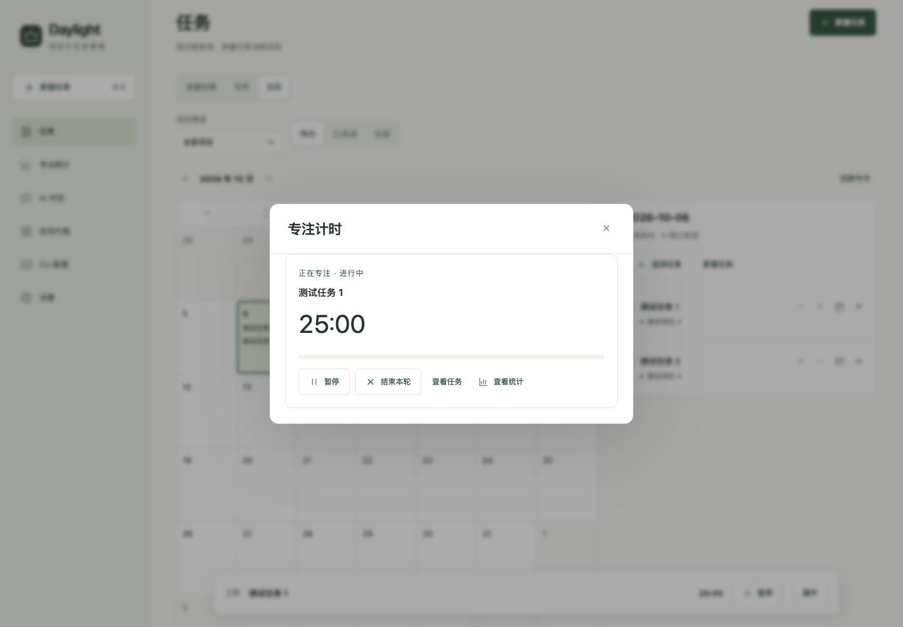
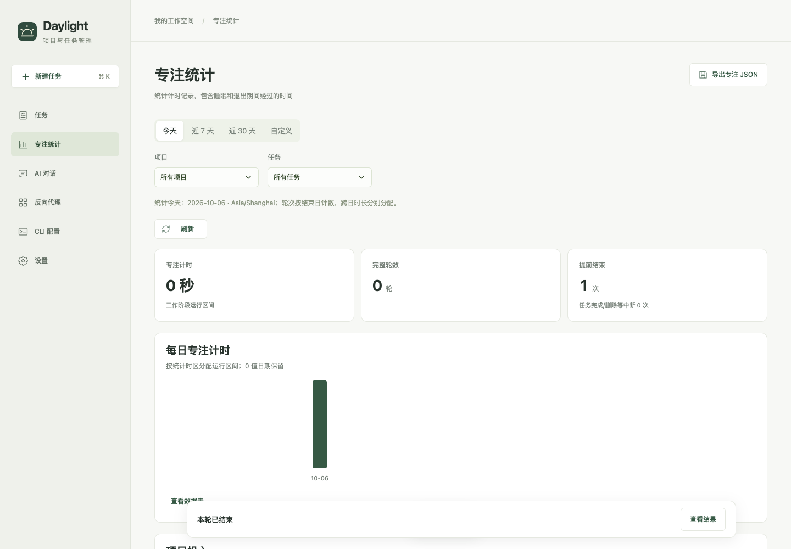

# 日历与专注验证记录

基线 156250b70ffce8ecb1eec218055bc963e85feb29。多智能体分别实施共享核心/Node/AI、前端和原生，主智能体负责接口整合、外部客户端、恢复卡、性能入口和最终复核。以下原有记录保留 2026-10-06 的交付证据，末节登记 2026-10-07 的复核修复与最新回归。功能代码已经实现；原生授权允许/拒绝与实际通知展示尚未通过，真实睡眠唤醒未完成实操验收，因此总验收不能标为全部完成。

验证写入只针对临时合成任务、专注和会话，使用独立端口及 Chrome profile。2026-10-06 未替换 /Applications/Daylight.app；2026-10-07 按用户授权完成本地 App 替换，旧 App 与完整数据已备份，安装读回见末节。未同步独立 Skill、改写用户任务/对话/凭据、提交或推送代码。

## 2026-10-06 自动化与实际运行

| 层级 | 执行及结果 |
| --- | --- |
| 全量静态/Node | npm run check、npm test 通过，279/279 项、无跳过；包含原任务、AI、代理、资源打包回归与新增状态机、时区、统计、CLI、持久 AI 恢复、新旧撤销和未知重试 |
| 原生构建 | npm run pack:mac 成功，产物 dist/native/Daylight.app；保留原 ad-hoc 签名方式 |
| 任务/资源 | npm run test:native、npm run test:contracts 通过；Node 与实际 Swift HTTP 共用合同，全部 allowlist 资源实际可读 |
| 专注合同 | npm run test:focus-contracts 通过；输入、鉴权、receipt、版本、原子失败、恢复、任务终止、时钟异常及 headless 边界 |
| 实际时区 | npm run test:native-focus-time-zone 通过；Foundation/Node 对照 UTC、DST 23/25 小时、Kathmandu、Samoa 消失日期、Lord Howe 半小时切换 |
| 原生侧车 | test/native-ai-test.py、test/native-proxy-test.py 通过；CLI 模型发现与鉴权、fake upstream/streaming、自动启动、退出清理、缺 Node 恢复；未发送真实模型推理 |
| 真实 Chrome | 六份报告共 45 条断言全部通过：基础 13、AI 恢复 6、编辑保护/暂停切换 9、390px 4、设置展示 7、报表生命周期 6。包含 6 条无异常守卫；设置报告模拟原生回复，其余实际页面操作使用隔离服务 |
| 原生大响应客户端 | 最终原生构建对 Node v22.23.2 原生 fetch→response.json() 连续读取 1000 任务 state、366 天统计，各 50 次通过；没有复现早期 undici assertion，不能据此宣称历史问题已经修复；[报告](calendar-focus/native/fetch-compatibility.json) |
| 原生 GUI | 独立 bundle ID 的临时 App 实际展示页面，WK getStatus 返回 default，真实系统点击调用 authorize 并显示 OS 错误；通知允许/拒绝及展示仍缺证据 |
| 原生闭窗计时 | 工作区 App 使用隔离目录/端口直接运行，按精确 PID 关闭主窗口，窗口数 1→0 后进程继续运行，60 秒到期由 timer 保存 completed；实际观察落盘延迟 621ms、elapsedMs=60000、通知 none；[报告](calendar-focus/native/closed-window-report.json) |
| 原生菜单控件 | 最终构建精确 PID 实测菜单跨 ticker 保持项目，02:59→02:57；展开期间外部设置使 focus v1→2，再实际点击暂停 v3、继续 v4、结束 v5 均成功，task v0/todo 保持，通知 none；[报告](calendar-focus/native/tray-report.json) |
| 原生任务子菜单 | 最终构建精确 PID 实际点击开始任务→task v1/active、暂停任务→task v2/todo，focus v0/null 保持；开始专注→focus v1/work、结束→focus v2/null，task v2/todo 保持、通知 none；[报告](calendar-focus/native/task-submenu-report.json) |

交叉复核已修复：旧 PUT 忙碌时日历 action 的未发送 pending 污染；服务重启后会话 token 更新；运行中任务累计每 15 秒刷新与卸载清理；设置恢复可见的权限核对；不足一秒记录的显示；静态允许列表中未被打包的多余核心资源。真实菜单点击还发现 menuDidClose 重建菜单时提前清理 UUID 回调导致暂停空操作，[失败证据](calendar-focus/native/tray-before-callback-fix.json) 保留；改为菜单项通过 representedObject 持有回调对象，旧 sender 在 AppKit 投递动作时仍能执行，不依赖全局回调表或菜单关闭顺序。独立源码复核及实际暂停/继续/结束复测通过。

## 2026-10-06 性能门槛

本节数字和通过结论仅对应 10-06 保存的报告。10-07 的服务与基准已增加持久写负载及跨重启/consumer RSS 观测，不能沿用本节作为新版预算通过证据；最新状态见末节。

入口 `npm run benchmark:focus`，每运行时每规模预热 5 次、至少 30 次查询/动作，包含真实 HTTP、全文件编码、上一版、临时写入与原子替换，通知消费实际持久保存。50 个项目、1000 个任务，20% 历史有暂停段，包含删除任务快照。环境、样本大小、完整 p50/p95/max 与预算字段保存在 [Node 报告](calendar-focus/node-performance.json) 和 [原生报告](calendar-focus/native-performance.json)。

| 运行时/历史数 | 报表 P95 | 连续同步占用最大值 | 到期实际落盘最大延迟 | RSS 相对空进程峰值增加 |
| --- | ---: | ---: | ---: | ---: |
| Node / 10k | 8.0 ms | 33.2 ms | 66 ms | 105.3 MiB |
| Node / 50k | 15.5 ms | 59.4 ms | 212 ms | 307.8 MiB |
| Swift / 10k | 18.2 ms | 33.1 ms | 213 ms | 644.6 MiB |
| Swift / 50k | 52.8 ms | 349.6 ms | 274 ms | 455.5 MiB |

所有预算字段通过，包括 state P95≤200ms/≤32KiB、动作 P95≤1500ms、366 天统计及全历史累计 P95≤2000ms、负载下任务读取 P95≤500ms、连续同步占用≤500ms、到期落盘延迟≤2000ms、峰值 RSS 增量≤768MiB。

G 复核收紧测量：Node 在同一事件循环边界前累计同步规则、日期窗口、统计及编码，排除异步磁盘等待；Swift 计完整串行操作与通知消费。到期通过磁盘首次读到已原子替换的归档结果计时，不使用保存之前生成的 observedAt；无 focus HTTP 请求的 timer 与报表负载分别测试。

每项在 30 次计时查询后追加 300 次同条件只读查询。前后 10 次 RSS 中位数增幅依上表顺序为 1.0/13.3/0.6/0.2 MiB，追加查询的末三批相对紧邻的前一组三批中位数变化为 +3.9/−115.8/+1.3/+0.4 MiB。初始增长≤64MiB、末端增长≤16MiB 是补充诊断阈值，不替代原定峰值预算，也不能证明无限运行没有泄漏。原生峰值在重复测量间有明显波动，表格使用最新完整测量，没有取多轮中的最小值。

延长查询曾发现原生桥 RSS 持续增长并超过原峰值预算，[失败报告](calendar-focus/memory-before-native-bridge-fix.json) 保留了该证据。只加 autorelease pool 仍未解决，[中间复测](calendar-focus/native-memory-pool-only.json) 没有作为通过结论。最终改为固定 JavaScriptCore 函数通过 JSValue.call 传参，避免反复编译动态脚本文本；任务镜像按已提交 taskVersion 更新，待核对任务变更保留顺序，不改变专注记录的唯一权威和保存成功后替换语义。

[原生长查询复测](calendar-focus/native-memory-soak.json) 每规模 1,500 次，未主动触发 GC：10k RSS 峰值 101.9MiB、结束 84.1MiB；50k 峰值 334.7MiB、结束 204.0MiB，观察到自然回收。[Node 长查询复测](calendar-focus/node-memory-soak.json) 对 50k 历史连续 3,000 次读取，循环内不强制 GC，并观察到自然 major GC；仅起点和终点强制 GC 比较保留 heap，差值 0.089MiB。两份长查询均未改 focus 文件，用于判断内存回收，不作为并发时延预算证据。

菜单回调修复前的一轮原生 50k 通知消费重启遇到临时端口冲突，已改为只对明确的地址占用错误最多重试三次，每次重新创建整项 fixture，不直接重试已落盘的消费请求。菜单修复后，最终原生构建完整重跑两种规模全部通过，[原生报告](calendar-focus/native-performance.json) 记录 binary SHA256，和最终 GUI/客户端报告一致。Node 代码未受菜单修复影响，使用已通过的完整测量。C0 和中间报告作为阶段证据，当前结论以修正计量及最终构建报告为准。

## 2026-10-06 界面证据

[日历与计时](calendar-focus/browser/report.json)、[AI 恢复卡](calendar-focus/browser/ai/report.json)、[编辑保护/暂停切换](calendar-focus/browser/extended/report.json)、[390px 布局](calendar-focus/browser/narrow390/report.json)、[设置修订](calendar-focus/browser/settings-polish/report.json)、[报表生命周期](calendar-focus/browser/report-lifecycle/report.json) 六份报告共 45 条断言全部通过，errors 均为空。设置报告通过模拟原生回复核验错误呈现；真实 OS 验收另记。AI 恢复卡实际完成 unknown→原请求 replay→applied→acknowledge，操作消息只记一次。后台标签页、暂停及离开报表后各等待 16.5 秒没有额外报表查询，恢复可见立即读取。

[UI 清单](../../test/calendar-focus-ui.md) 保留实际执行范围；组合项不能因为部分子项通过而整体勾选。前端专项回归 29 项通过。设置采用独立选项行和统一复选框样式，失败反馈用中文说明，保留“上次读取”状态，系统原文默认折叠；最终截图使用合成数据默认 25/5 分钟。

## 2026-10-06 通知验收缺口

临时 GUI App 使用与业务 App 不同的 bundle ID，不改变原有用户的通知授权。实际点击设置中的授权按钮，系统返回“Notifications are not allowed for this application”，权限仍为 default。注册临时 App 到 LaunchServices、核对 bundle/signature identifier 后再次点击，结果相同。只读查询本机可用签名身份为 0；尚未证实这一现象的具体签名或平台策略根因。

来源限制由源码复核，请求相关性、超时/卸载及权限生命周期由模拟测试验证；实际 GUI 仅证明真实 WKWebView getStatus、显式点击调用 requestAuthorization、OS 错误返回页面。[GUI 报告](calendar-focus/native/gui-report.json) 分别登记已验证与未验证项。尚未验证允许/拒绝对话框、真实授权变更和已归档通知的系统展示。scheduled 只代表 OS 接受请求，不能证明用户看到了提醒。授权 API 与错误回调的区分参照 [Apple requestAuthorization](https://developer.apple.com/documentation/usernotifications/unusernotificationcenter/requestauthorization(options:completionhandler:))，当前状态读取参照 [Apple authorizationStatus](https://developer.apple.com/documentation/usernotifications/unnotificationsettings/authorizationstatus)。

第一次 GUI 自动化中，System Events 的同名进程解析曾可能关闭已安装 App 的主窗口；已恢复并核对原窗口，没有终止/替换 App、改用户数据或通知权限。后续 GUI 操作限定临时 PID，正式 App 截图没有加入证据目录。

关闭主窗口继续计时与到期保存已用工作区构建实测，提醒关闭，未请求/投递系统通知；合成任务的[闭窗前截图](calendar-focus/native/before-close.png) 和落盘报告保留。该 60 秒样本来自菜单回调修复前构建，最终构建再次核对闭窗驻留并实际完成[暂停/继续/结束菜单流程](calendar-focus/native/tray-report.json)，计时适配器未改变。临时 App 副本曾在产品初始化之前停滞，不能把这些副本的启动结果解释为 GUI 代码回归；改直接运行工作区构建后成功，临时进程已经停止。

后续需在系统允许该 App 请求通知的签名/安装环境中，用隔离任务复核允许、拒绝、实际提醒和通知点击定位；真实睡眠唤醒仍需实际 GUI 证据。任务子菜单“开始任务/开始专注”的状态和版本边界已实际点击验证，见[子菜单截图](calendar-focus/native/task-submenu.png)及报告。剩余缺口不影响已经验证的专注保存、计时恢复、统计和页内反馈。

## 2026-10-07 复核修复与回归

本轮修复日历有效年份边界和日期选择的历史语义、时钟冻结后继续条件的共享判断、到期通知投递错误在结果/设置中的展示，以及可信 AI 审阅内容和普通计划操作的日期定位。AI prepare 的 impact 保存真实标题快照、阶段、目标/累计/剩余时长，批准 body 保持原样；恢复记录保留同一 impact。Node 磁盘错误统一返回 503/FOCUS_SAVE_FAILED，保存失败不替换权威对象，故障解除后重试原请求只生效一次。

| 层级 | 执行及确认结果 |
| --- | --- |
| 全量源码/Node | 最终源码 `npm run check`、`npm test` 通过，292/292 项，无跳过 |
| 实际 Swift/HTTP | Swift 任务回归、24 项任务合同、[Node/实际 Swift 专注合同](calendar-focus/review-fix-native/focus-contract-report.json)、Foundation 时区回归通过 |
| 原生侧车/外部客户端 | native AI、proxy、CLI conversations 回归通过；使用隔离合成数据和 mock/fake upstream，没有真实模型推理 |
| 最终构建身份 | binary SHA256：`2f4bac81c44f40920d6e6ac968e2c05820c60986ef18fa677d9fdcffecad8f15`；已安装至 /Applications/Daylight.app，实际进程与构建 hash 一致 |
| 独立 Chrome | [本轮报告](calendar-focus/review-fix-browser/report.json) 19 条断言全部通过，errors 为空；前 6 条用临时 Node 服务验证真实日历页面、首末日期边界和浏览器历史；第 7–18 条为真实 widget/panel/settings 组件加受控快照/模拟原生状态；第 19 条为异常守卫 |
| Codex/Qoder AI 恢复 | `test/focus-ai.test.mjs` 两后端共用草稿→批准→保存→重启→原请求恢复矩阵通过；mock 适配器走真实本地工具/HTTP，验证 trusted impact、原 body 不变、无活跃 run 回执恢复、waiter 一次结算、消息去重与只读 question 并存。该专项不是外部模型端到端实测 |
| 通知 consumer | 新入口 `npm run test:native-focus-notifications` 用系统 Swift（macOS 13 目标）执行生产 Focus.swift/FocusTimeZone.swift、精确 consumer 和最终 native-core，真实临时存储/注入 delivery；两个独立目录全部断言通过，[报告](calendar-focus/review-fix-native/notification-consumer-report.json) 明确区别源码边界和打包二进制 HTTP |
| 新版性能 | [四组合最终报告](calendar-focus/review-fix-performance.json) 通过；Node/Swift × 10k/50k 全部预算为 true、pendingMeasurements 为空，使用最终二进制 |
| 系统通知/睡眠 | [直接启动](calendar-focus/review-fix-native/workspace-gui-allow-report.json)与[LaunchServices 隔离启动](calendar-focus/review-fix-native/workspace-gui-launchservices-report.json)均未进入授权流程；后者精确 PID 日志记录 SIGKILL，所有副本/数据已清理，未更改正式 App 权限；allow/deny、实际 display、click 定位及真实 sleep/wake 仍缺实操证据 |

通知 consumer 测试针对保存失败不 delivery、修复后先持久 attempted 再注入一次、旧 pending DTO 不重发、attempted 后重启不补投递的边界。它不实例化系统通知中心，不请求权限、不提交 OS 通知；先前自签名辅助程序曾一次成功，后续多次在断言前 SIGKILL；[原启动失败](calendar-focus/review-fix-native/notification-consumer-prior-startup-failures.json)和[fresh-inode 失败](calendar-focus/review-fix-native/notification-consumer-fresh-inode-failure.json)均保留。最终测试采用系统 Swift，无新自签名 executable、不实例化通知中心，没有调整系统安全策略；两次通过不能反推旧 SIGKILL 的根因。

新版基准增加 idle、报表和持续持久写入三种到期压力：成功动作必须实际保存，409 仅刷新版本，独立磁盘观察确认 current 清空及对应归档结果；RSS 包括重启与独立通知 consumer 子进程。最终四组合已核对，新增写负载场景均有到期前成功持久写入。浏览器模拟只证明时钟条件/反馈/UI 行为，不证明真实回拨恢复落盘或 OS 通知。上面的组合项与 [UI 清单](../../test/calendar-focus-ui.md) 继续按实际证据保留状态。

本轮最终性能每组合预热 5 次、计时至少 30 次、追加 300 次查询，重启服务及独立通知 consumer 的 RSS 也纳入峰值。报告记录 JavaScriptCore 版本 21624、build 21624.2.5.11.4。原生 50k 首次遇到明确地址占用，只换端口并重新建立完整合成 fixture 重测；没有重试消费写入。预算和测量口径保持原定标准。

| 运行时/历史数 | 报表 P95 | 连续同步占用最大值 | 无请求/报表/持久写负载到期落盘延迟 | RSS 相对空进程峰值增加 | 到期前已保存动作数 |
| --- | ---: | ---: | ---: | ---: | ---: |
| Node / 10k | 7.8 ms | 32.1 ms | 72 / 84 / 77 ms | 109.8 MiB | 78 |
| Node / 50k | 18.2 ms | 114.4 ms | 180 / 197 / 350 ms | 308.3 MiB | 20 |
| Swift / 10k | 17.9 ms | 34.3 ms | 197 / 52 / 81 ms | 105.5 MiB | 145 |
| Swift / 50k | 54.3 ms | 333.9 ms | 297 / 165 / 104 ms | 417.2 MiB | 33 |

10-07 的最终性能结论以这一报告为准；review-fix-node-performance.json 是 RSS consumer 采样补齐前的中间记录。有限 RSS 采样仍不等于无限期无泄漏证明。

### 本地 App 替换与读回

[安装报告](calendar-focus/review-fix-install.json) 记录本地 0.4.0 更新。安装前代理 activeRequests=0、两对话 idle；精确 PID 17040 的窗口只包含只读 Base URL/API Key 与示例协议选择，没有编辑弹窗。旧进程正常退出后备份完整数据并逐文件核对，旧 App 与新暂存 App 均先验证文件和签名；未强制终止其他进程。新 /Applications/Daylight.app 全包与已测试构建一致、strict 签名通过，实际 PID 36268 的窗口显示 Daylight、日历、专注统计和设置入口。

项目 3、任务 11、taskVersion 22、对话 2 且 idle 均保留；代理自动恢复 running/4319、activeRequests=0。原有 81,865 个文件无丢失，唯一变更是 grok/catalog.json 的 /at 刷新时间；所有模型/cache 内容字段与备份完全相同，任务、AI 与配置权威文件摘要再次核对一致。新增 focus.json 是首次启动初始化，focus version=0、current=null；实际平台状态 native/system、permission=default，没有请求授权或提交提醒。

第一次严格字节检查把缓存时间变化标为失败；安全回退检查遇到主页控件时保留了新版，没有强制退出、回滚 App 或恢复用户数据。随后核对仅 /at 改变和所有其他安装/数据条件，确认通过；原始失败原因与修正说明均保留在安装报告中。没有将全部文件写成“零变化”。

- App 与数据备份：`.local/app-backups/20261007-201715-calendar-focus/`，目录权限 0700；完整私有摘要和安装记录不加入版本控制。
- 保留旧安装：`/Applications/.Daylight-old-20261007-201715.app`。
- 细节记录：`.local/verification/calendar-focus-install-20261007-201715.json`。

本地替换通过不改变系统通知允许/拒绝、展示、点击定位与真实睡眠唤醒的未验状态；计划总验收仍保留这些实操项。
